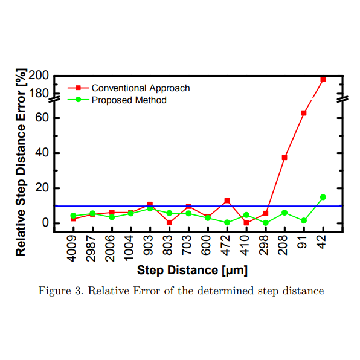

{{ page.authors }}

## Abstract
> THz imaging and sensing has demonstrated a wide-ranging application potential. However, the transfer of such basic applicability observations to real-world application scenarios is severely obstructed by fundamental limitations imposed by the comparatively long wavelength of this analytic technique. In this presentation, an overview of recent signal processing developments for the enhancement of the analytic performance of THz imaging and sensing systems is presented. The first part of the presentation introduces advanced signal processing techniques to enhance the spectroscopic investigation capability of THz systems. Experiments are performed at particularly difficult application situations, including inter alia very thin material systems or measurements with strongly absorptive features beyond the signal to noise limitations of spectroscopic instrumentation. Model- based numeric procedures for spectroscopic investigation with pulsed THz systems are derived, which enhance the analytic material data quality by two orders of magnitude in comparison to established numeric procedures. Furthermore, computer vision based blind-deconvolution superresolution approaches are introduced, which allow the unassisted increase of imaging resolution beyond the diffraction limit. Experiments performed with a FMCW- based THz imaging system operating from 514 - 640 GHz demonstrate a resolution increase by a factor of 2.3 beyond the diffraction limit, without requiring any prior knowledge on the point-spread function size or shape of the imaging system, but based on a direct analysis of the imaging data of an unknown target sample.

## Resources

<a href=" {{ page.paperurl }} ">[pdf]</a> <a href=" {{ page.arxiv }} ">[arxiv]</a> <a href=" {{ page.code }} ">[github]</a> <a href=" {{ page.video }} ">[video]</a> <a href=" {{ page.poster }} ">[video]</a>

## Bibtex

    @inproceedings{stock2019advanced,
        title={Advanced signal processing techniques for THz imaging and sensing enhancement in material quality control applications},
        author={Stock, Daniel and Kahl, Matthias and Wigger, Anna K and Wong, Tak Ming and Kolb, Andreas and Bol{\'\i}var, Peter Haring},
        booktitle={Terahertz, RF, Millimeter, and Submillimeter-Wave Technology and Applications XII},
        volume={10917},
        pages={127--133},
        year={2019},
        organization={SPIE}
    }