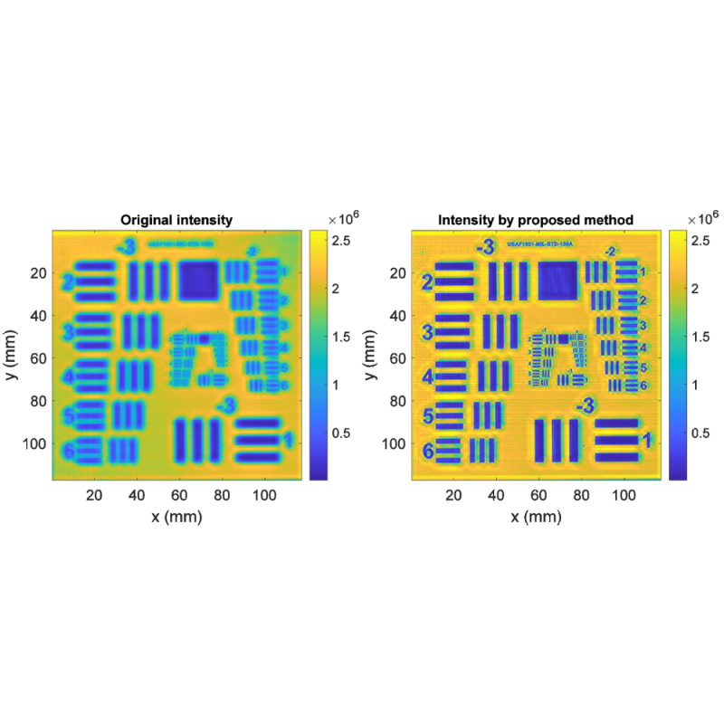

{{ page.authors }}

## Abstract
> In this paper, a novel method to enhance Frequency Modulated Continuous Wave (FMCW) THz imaging resolution beyond its diffraction limit is proposed. Our method comprises two stages. Firstly, we reconstruct the signal in depth-direction using a sinc-envelope, yielding a significant improvement in depth estimation and signal parameter extraction. The resulting high-precision depth estimate is used to deduce an accurate reflection intensity THz image. This image is fed in the second stage of our method to a 2D blind deconvolution procedure, adopted to enhance the lateral THz image resolution beyond the diffraction limit. Experimental data acquired with a FMCW system operating at 577 GHz with a bandwidth of 126 GHz shows that the proposed method enhances the lateral resolution by a factor of 2.29 to 346.2 μm with respect to the diffraction limit. The depth accuracy is 91 μm. Interestingly, the lateral resolution enhancement achieved with this blind deconvolution concept leads to better results in comparison with conventional gaussian deconvolution. Experimental data on a PCB resolution target is presented, in order to quantify the resolution enhancement and to compare the performance with established image enhancement approaches. The presented technique allows exposure of the interwoven fiber reinforced embedded structures of the PCB test sample.

## Resources

<a href=" {{ page.paperurl }} ">[pdf]</a> <a href=" {{ page.arxiv }} ">[arxiv]</a> <a href=" {{ page.code }} ">[github]</a> <a href=" {{ page.video }} ">[video]</a> <a href=" {{ page.poster }} ">[video]</a>

## Bibtex

    @article{wong2019computational,
        title={Computational image enhancement for frequency modulated continuous wave (FMCW) THz image},
        author={Wong, Tak Ming and Kahl, Matthias and Haring Bol{\'\i}var, Peter and Kolb, Andreas},
        journal={Journal of Infrared, Millimeter, and Terahertz Waves},
        volume={40},
        pages={775--800},
        year={2019},
        publisher={Springer}
    }