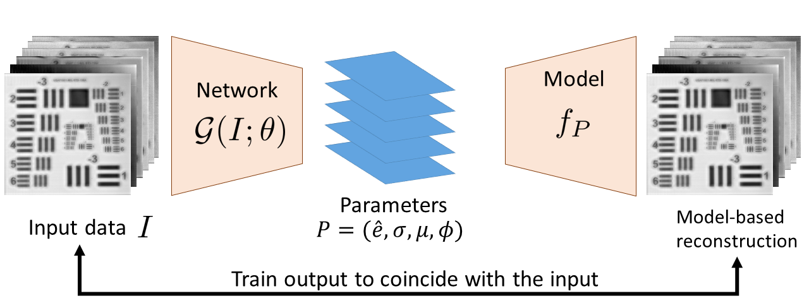

{{ page.authors }}

## Abstract
> Terahertz (THz) sensing is a promising imaging technology for a wide variety of different applications. Extracting the interpretable and physically meaningful parameters for such applications, however, requires solving an inverse problem in which a model function determined by these parameters needs to be fitted to the measured data. Since the underlying optimization problem is nonconvex and very costly to solve, we propose learning the prediction of suitable parameters from the measured data directly. More precisely, we develop a model-based autoencoder in which the encoder network predicts suitable parameters and the decoder is fixed to a physically meaningful model function, such that we can train the encoding network in an unsupervised way. We illustrate numerically that the resulting network is more than 140 times faster than classical optimization techniques while making predictions with only slightly higher objective values. Using such predictions as starting points of local optimization techniques allows us to converge to better local minima about twice as fast as optimizing without the network-based initialization.

## Resources

<a href=" {{ page.paperurl }} ">[pdf]</a> <a href=" {{ page.arxiv }} ">[arxiv]</a> <a href=" {{ page.code }} ">[github]</a> <a href=" {{ page.video }} ">[video]</a> <a href=" {{ page.poster }} ">[video]</a>

## Bibtex

    @inproceedings{wong2019training,
        title={Training auto-encoder-based optimizers for terahertz image reconstruction},
        author={Wong, Tak Ming and Kahl, Matthias and Haring-Bol{\'\i}var, Peter and Kolb, Andreas and M{\"o}ller, Michael},
        booktitle={German Conference on Pattern Recognition},
        pages={93--106},
        year={2019},
        organization={Springer}
    }