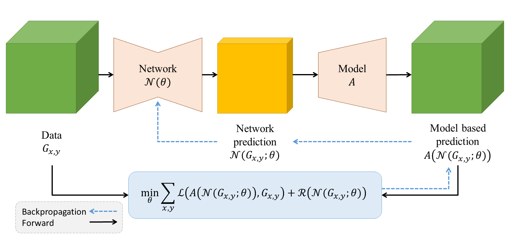

{{ page.authors }}

## Abstract
> In this paper, we propose a deep optimization prior approach with application to the estimation of material-related model parameters from terahertz (THz) data that is acquired using a Frequency Modulated Continuous Wave (FMCW) THz scanning system. A stable estimation of the THz model parameters for low SNR and shot noise configurations is essential to achieve acquisition times required for applications in, e.g., quality control. Conceptually, our deep optimization prior approach estimates the desired THz model parameters by optimizing for the weights of a neural network. While such a technique was shown to improve the reconstruction quality for convex objectives in the seminal work of Ulyanov et. al., our paper demonstrates that deep priors also allow to find better local optima in the non-convex energy landscape of the nonlinear inverse problem arising from THz imaging. We verify this claim numerically on various THz parameter estimation problems for synthetic and real data under low SNR and shot noise conditions. While the low SNR scenario not even requires regularization, the impact of shot noise is significantly reduced by total variation (TV) regularization. We compare our approach with existing optimization techniques that require sophisticated physically motivated initialization, and with a 1D single-pixel reparametrization method.

## Resources

<a href=" {{ page.paperurl }} ">[pdf]</a> <a href=" {{ page.arxiv }} ">[arxiv]</a> <a href=" {{ page.code }} ">[github]</a> <a href=" {{ page.video }} ">[video]</a> <a href=" {{ page.poster }} ">[video]</a>

## Bibtex

    @inproceedings{wong2022deep,
        title={Deep optimization prior for thz model parameter estimation},
        author={Wong, Tak Ming and Bauermeister, Hartmut and Kahl, Matthias and Bol{\'\i}var, Peter Haring and M{\"o}ller, Michael and Kolb, Andreas},
        booktitle={Proceedings of the IEEE/CVF Winter Conference on Applications of Computer Vision},
        pages={3811--3820},
        year={2022}
    }