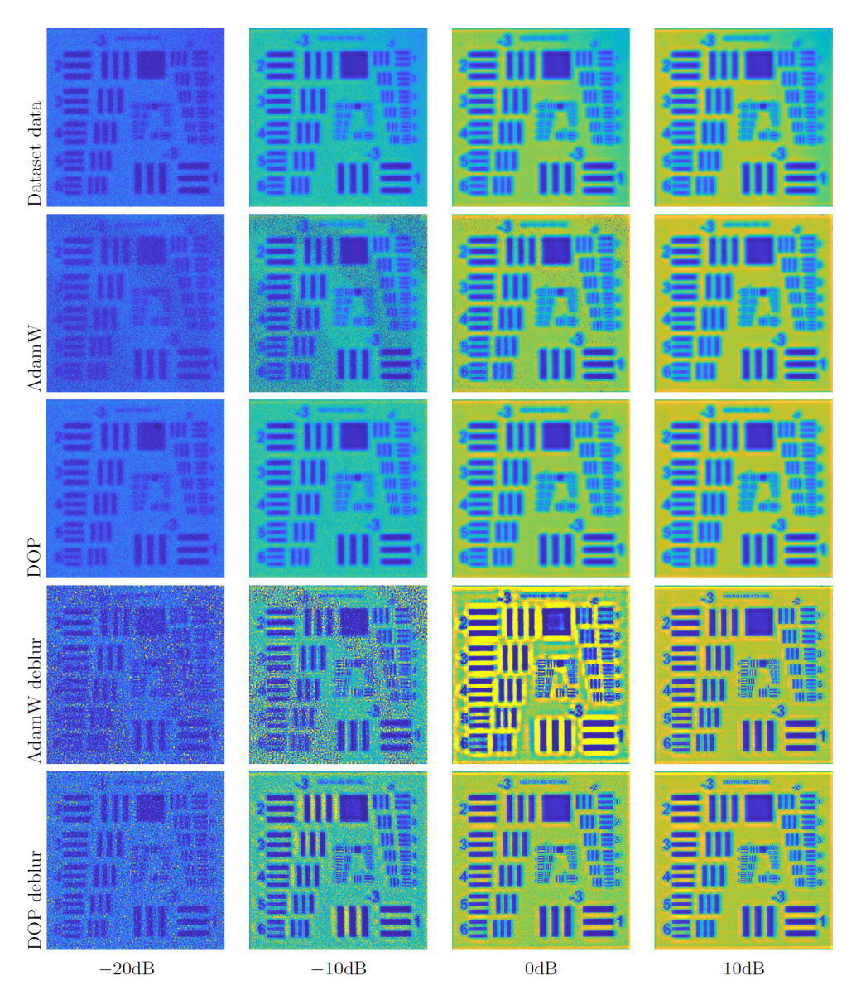

{{ page.authors }}

## Abstract
> A stable estimation of the THz model parameters for low SNR configurations is essential to achieve acquisition times required for applications in, e.g., quality control. The deep optimization prior approach was introduced with application to the estimation of material-related model parameters from THz data, which is acquired by a FMCW THz scanning system. Conceptually, this approach estimates the desired THz model parameters by optimizing for the weights of a 3D spatially coupled deep neural network. This approach was verified numerically on various THz parameter estimation problems for synthetic and real data. In this paper, we propose to combine the deep optimization prior approach to the modern 2D blind deblurring method for the FMCW THz image resolution enhancement. The experimental results show that this approach improves the lateral resolution enhancement robustly under low SNR noise condition in comparison to the per-pixel curve fitting method.

## Resources

<a href=" {{ page.paperurl }} ">[pdf]</a> <a href=" {{ page.arxiv }} ">[arxiv]</a> <a href=" {{ page.code }} ">[github]</a> <a href=" {{ page.video }} ">[video]</a> <a href=" {{ page.poster }} ">[video]</a>

## Bibtex

    @article{wong2022deep,
        title={Deep Neural Network as an Optimizer for FMCW THz Image Deblurring},
        author={Wong, Tak Ming and Bauermeister, Hartmut and Kahl, Matthias and Bol{\i}var, Peter Haring and M{\"o}ller, Michael and Kolb, Andreas},
        journal={ATHENA Research Book, Volume},
        pages={13},
        year={2022}
    }