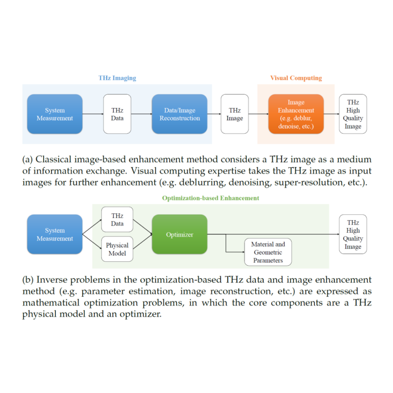

{{ page.authors }}

## Abstract
> THz imaging is significantly limited in its spatial resolution due to the substantially longer wavelength of the associated frequencies, which has made the problem of imaging beyond diffraction limit to be an emerging challenge in the THz research community. In this dissertation, an optimization-based THz data and imaging enhancement concept is introduced. In this context, inverse problems in THz data and image enhancement, such as parameter estimation, image reconstruction, denoising and deblurring, are expressed as mathematical optimization problems, in which the core components are a physical model and an optimizer. Instead of solely maximizing the subjective improvement in terms of the visual perception, the optimizer minimizes an objective measure between the THz physical model and the measured THz data. This concept enables various kinds of computational optimization methods, for example, classical gradient descent based optimizers and modern neural network based optimizers, to solve the non-convex optimization problems and to estimate the material-related THz parameters from the measured THz data. Experiments show that this concept is beneficial for resolution enhancement, the ability to find energy minima, the requirements of measured data size, the robustness of parameter estimation, and computational resources. This study demonstrates the advantages brought by the cross-disciplinary collaboration between the fields of THz imaging and visual computing.

## Resources

<a href=" {{ page.paperurl }} ">[pdf]</a> <a href=" {{ page.arxiv }} ">[arxiv]</a> <a href=" {{ page.code }} ">[github]</a> <a href=" {{ page.video }} ">[video]</a> <a href=" {{ page.poster }} ">[video]</a>

## Bibtex

    @article{wong2023optimization,
        title={Optimization-based enhancement of THz data and image},
        author={Wong, Tak Ming},
        year={2023}
    }