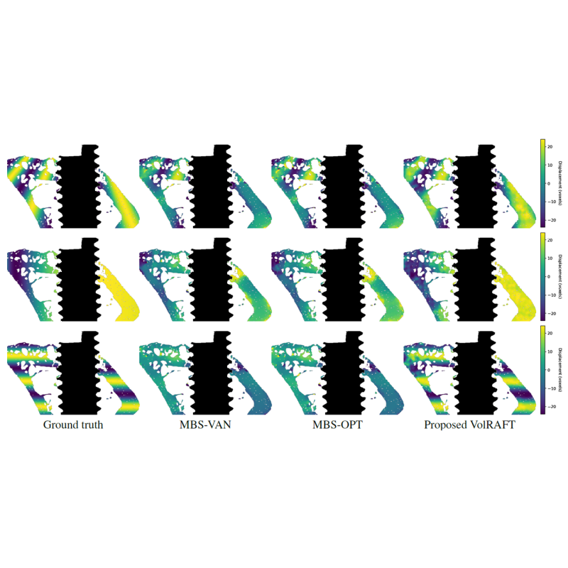

{{ page.authors }}

## Abstract
> In materials science research, digital volume correlation (DVC) analysis is commonly used to track deformations and strains to elucidate morphology-function relationships. Optical flow-based DVC is particularly popular because of its robustness to estimate the correlation as a dense deformation vector. Recently, computer vision researchers showed that network-based optical flow approaches can outperform classical iterative optical flow approaches. In this paper, we propose a supervised machine learning approach for digital volume correlation, VolRAFT, that estimates the 3D displacement vector between the reference volume and the deformed volume. The proposed approach extends the state-of-the-art network-based optical flow method, RAFT, from 2D images to 3D volumes such that it predicts the volumetric displacement vector from the input volume pairs. Experiments show that the proposed network performs well in estimating different displacement fields when compared to cutting-edge iterative DVC methods for bone-implant materials based on high resolution synchrotron-radiation micro-computed tomography imaging data.

## Resources

<a href=" {{ page.paperurl }} ">[pdf]</a> <a href=" {{ page.arxiv }} ">[arxiv]</a> <a href=" {{ page.code }} ">[github]</a> <a href=" {{ page.video }} ">[video]</a> <a href=" {{ page.poster }} ">[video]</a>

## Bibtex

    @InProceedings{wong2024volraft,
        author    = {Wong, Tak Ming and Moosmann, Julian and Zeller-Plumhoff, Berit},
        title     = {VolRAFT: Volumetric Optical Flow Network for Digital Volume Correlation of Synchrotron Radiation-based Micro-CT Images of Bone-Implant Interfaces},
        booktitle = {Proceedings of the IEEE/CVF Conference on Computer Vision and Pattern Recognition (CVPR) Workshops},
        month     = {June},
        year      = {2024},
        pages     = {53-62}
    }