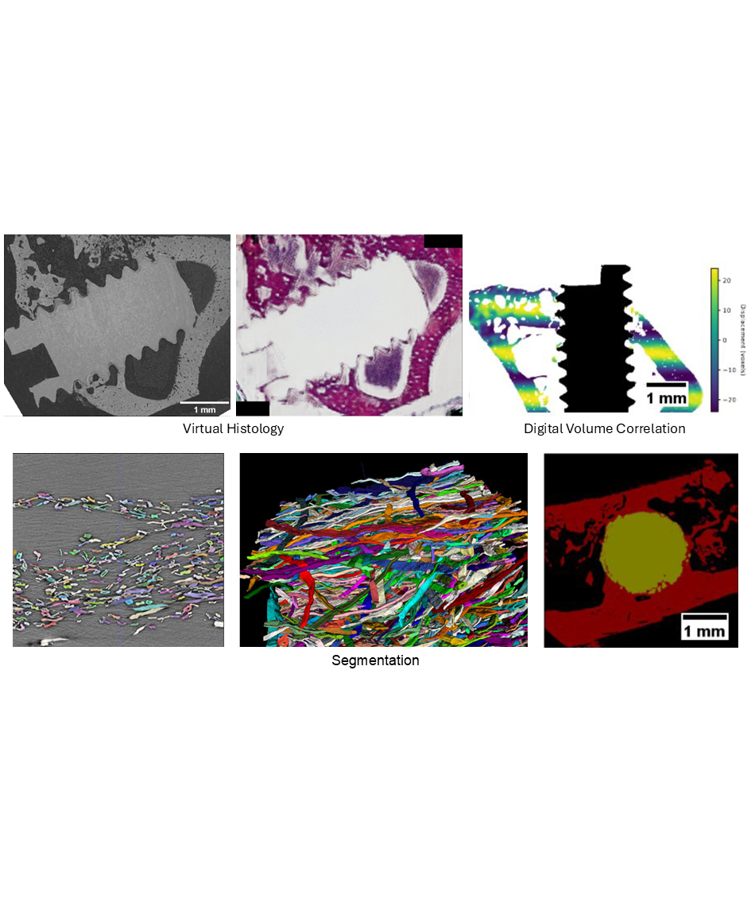

{{ page.authors }}

## Abstract
> The Helmholtz-Zentrum Hereon is operating imaging beamlines for X-ray tomography (P05 IBL, P07 HEMS) for academic and industrial users at the synchrotron-radiation source PETRA III at DESY in Hamburg, Germany. The high flux density and coherence of synchrotron radiation enable high-resolution in situ/operando/in vivo tomography experiments and phase-contrast imaging techniques, respectively. Large amounts of 3D and 4D data are collected that are difficult to process and analyze. Recently, we have explored machine learning approaches for the reconstruction, processing and analysis of synchrotron-radiation tomography data. Here, we report on the application of supervised learning for multimodal data analysis to generate a virtual 3D histology, digital volume correlation of 4D in situ tomography data, and instance segmentation. Furthermore, we present findings related to unsupervised learning in the context of semantic segmentation.

## Resources

<a href=" {{ page.paperurl }} ">[pdf]</a> <a href=" {{ page.arxiv }} ">[arxiv]</a> <a href=" {{ page.code }} ">[github]</a> <a href=" {{ page.video }} ">[video]</a> <a href=" {{ page.poster }} ">[video]</a>

## Bibtex

    @InProceedings{moosmann2024machine,
        title       = {Machine learning for the reconstruction and analysis of synchrotron-radiation tomography data},
        author      = {Moosmann, Julian P and Irvine, Sarah and Hailu, Dawit and Kazimi, Bashir and Wong, Tak and Yang, Xiaogang and Heuser, Philipp and Jentschke, Thomas and Kulvait, Vojtech and Zeller-Plumhoff, Berit and others},
        booktitle   = {Developments in X-Ray Tomography XV},
        volume      = {13152},
        pages       = {131520Z},
        year        = {2024},
        organization= {SPIE}
    }