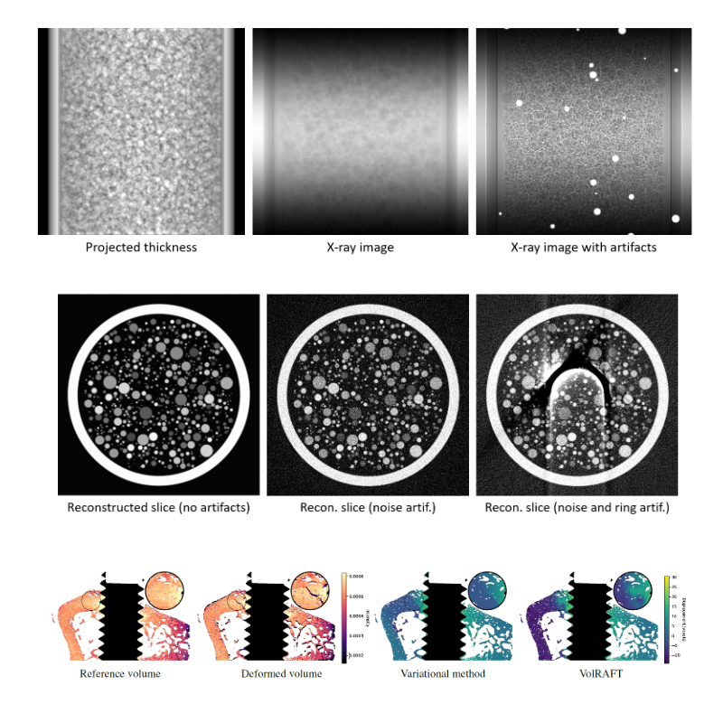

{{ page.authors }}

## Abstract
> The size of 4D tomography datasets acquired at synchrotron or neutron imaging facilities can reach several terabytes, which presents a significant challenge for their evaluation. This paper presents a framework that allows a compressed dataset to be kept in memory and makes it possible to evaluate and manipulate the dataset without requiring enough memory to decompress the entire dataset. The framework enables the compensation of imaging artifacts, including the compression artifacts of the 4D dataset, through the integration of neural networks. The reduction of imaging artifacts can be performed at the imaging facility or at the user's home institution. This framework reduces the computational burden on the computing infrastructure of large synchrotron and neutron facilities by allowing end users to process datasets on their institution's computers. This is made possible by compressing TBs of data to less than 128 GB, allowing powerful PCs to process TBs of 4D tomography data. 

## Resources

<a href=" {{ page.paperurl }} ">[pdf]</a> <a href=" {{ page.arxiv }} ">[arxiv]</a> <a href=" {{ page.code }} ">[github]</a> <a href=" {{ page.video }} ">[video]</a> <a href=" {{ page.poster }} ">[video]</a>

<!-- ## Bibtex

    @InProceedings{moosmann2024machine,
        title       = {Machine learning for the reconstruction and analysis of synchrotron-radiation tomography data},
        author      = {Moosmann, Julian P and Irvine, Sarah and Hailu, Dawit and Kazimi, Bashir and Wong, Tak and Yang, Xiaogang and Heuser, Philipp and Jentschke, Thomas and Kulvait, Vojtech and Zeller-Plumhoff, Berit and others},
        booktitle   = {Developments in X-Ray Tomography XV},
        volume      = {13152},
        pages       = {131520Z},
        year        = {2024},
        organization= {SPIE}
    } -->