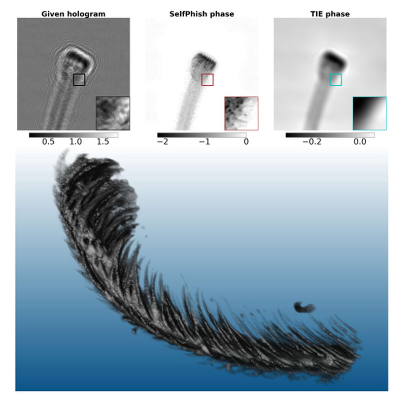

{{ page.authors }}

> This paper is highlighted as an Editors\' Pick.

## Abstract
> X-ray phase contrast imaging significantly improves the visualization of structures with weak or uniform absorption, broadening its applications across a wide range of scientific disciplines. Propagation-based phase contrast is particularly suitable for time- or dose-critical in vivo/in situ/operando (tomography) experiments because it requires only a single intensity measurement. However, the phase information of the wave field is lost during the measurement and must be recovered. Conventional algebraic and iterative methods often rely on specific approximations or boundary conditions that may not be met by many samples or experimental setups. In addition, they require manual tuning of reconstruction parameters by experts, making them less adaptable for complex or variable conditions. Here we present a self-learning approach for solving the inverse problem of phase retrieval in the near-field regime of Fresnel theory using a single intensity measurement (hologram). A physics-informed generative adversarial network is employed to reconstruct both the phase and absorbance of the unpropagated wave field in the sample plane from a single hologram. Unlike most state-of-the-art deep learning approaches for phase retrieval, our approach does not require paired, unpaired, or simulated training data. This significantly broadens the applicability of our approach, as acquiring or generating suitable training data remains a major challenge due to the wide variability in sample types and experimental configurations. The algorithm demonstrates robust and consistent performance across diverse imaging conditions and sample types, delivering quantitative, high-quality reconstructions for both simulated data and experimental datasets acquired at beamline P05 at PETRA III (DESY, Hamburg), operated by Helmholtz-Zentrum Hereon. Furthermore, it enables the simultaneous retrieval of both phase and absorption information.

## Resources

<a href=" {{ page.paperurl }} ">[pdf]</a> <a href=" {{ page.arxiv }} ">[arxiv]</a> <a href=" {{ page.code }} ">[github]</a> <a href=" {{ page.video }} ">[video]</a> <a href=" {{ page.poster }} ">[video]</a>

## Bibtex

    @article{yang2025self,
        title={Self-supervised physics-informed generative networks for phase retrieval from a single X-ray hologram},
        author={Yang, Xiaogang and Hailu, Dawit and Kulvait, Vojt{\v{e}}ch and Jentschke, Thomas and Flenner, Silja and Greving, Imke and Campbell, Stuart I and Hagemann, Johannes and Schroer, Christian G and Wong, Tak Ming and Moosmann, Julian},
        journal={Optics Express},
        volume={33},
        number={17},
        pages={35832--35851},
        year={2025},
        publisher={Optica Publishing Group}
    }
