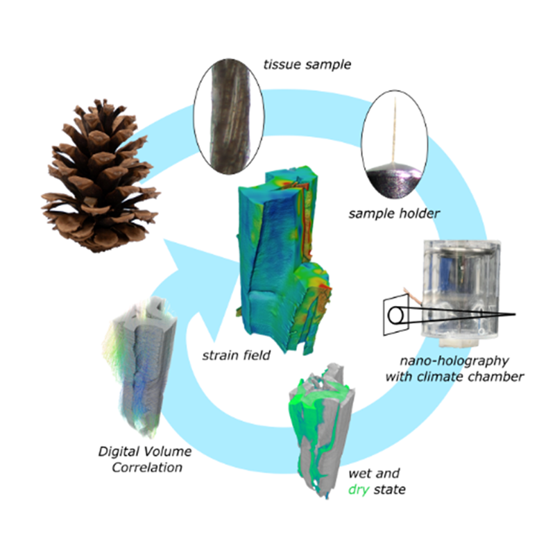

{{ page.authors }}

## Abstract
> Digital Volume Correlation (DVC) was used to study the hygroscopic shrinkage in lignocellulosic tissues. For this, small tissue segments of only a few cells were prepared from the endocarp of Hura crepitans fruits, the sclereid cell layer of Pinus jeffreyi pine cone scales, the sclerenchyma fiber sheath of peripheral vascular bundles in Marantochloa leucantha and latewood of Pinus sylvestris. The cells were imaged in a wet and dry state using X-ray nano-holotomography. Subsequently, a DVC analysis was conducted using Avizo™, elastix and MBS-3D-OptFlow, to visualize and quantify their hygroscopic shrinkage and to compare the accuracy of the approaches. The results reveal an anisotropic shrinkage behavior (1) along the cell length compared to radial shrinkage and (2) a greater radial than tangential shrinkage within the cell wall. The accuracy of the DVC results was validated and compared using two artificially deformed datasets (linear and sinusoidal) for controls. A (sub-)voxel accuracy for both controls could be demonstrated for each software with the image registration toolkit elastix performing best. In addition, the abundance of structural features in the cell walls leads to an improved DVC accuracy. Overall, DVC proved to be a viable approach to study the hygroscopic deformation of lignocellulosic tissue samples.

## Resources

<a href=" {{ page.paperurl }} ">[pdf]</a> <a href=" {{ page.arxiv }} ">[arxiv]</a> <a href=" {{ page.code }} ">[github]</a> <a href=" {{ page.video }} ">[video]</a> <a href=" {{ page.poster }} ">[video]</a>

## Bibtex

    @article{ulrich2025quantifying,
        title={Quantifying hygroscopic deformation in lignocellulosic tissues: a digital volume correlation tool comparison},
        author={Ulrich, Kim and Scheckenbach, Fabian and Wong, Tak Ming and Masselter, Tom and Flenner, Silja and Visconti, Anaclara and Nopens, Martin and Krause, Andreas and Kaschuro, Sergej and Benedikt Mietner, Jakob and Speck, Thomas and Greving, Imke and Zeller-Plumhoff, Berif and Linnea, Hesse},
        journal={Frontiers in Plant Science},
        volume={16},
        pages={1572745},
        year={2025},
        publisher={Frontiers}
    }
